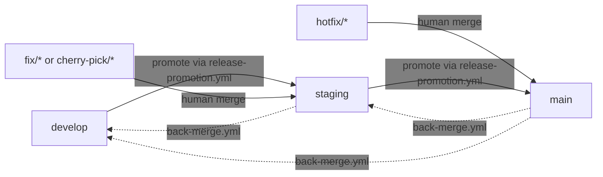
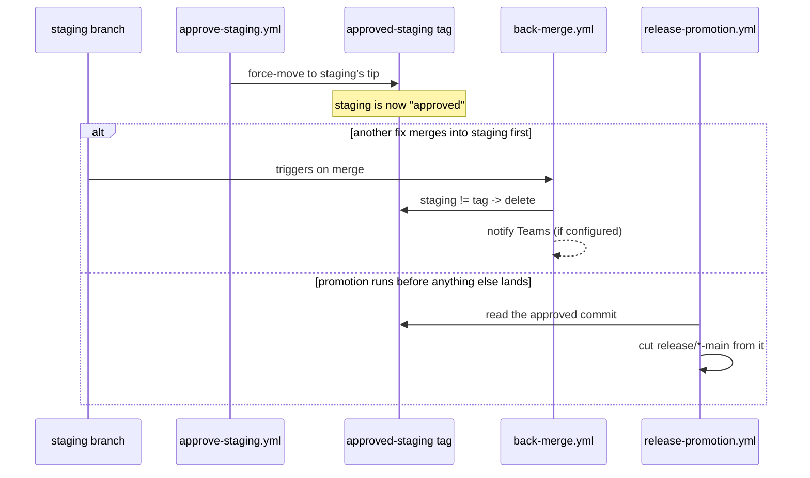

# Workflow Reference

Detailed reference for each reusable workflow in this repo. For pinning and versioning guidance, see [README.md](../README.md).

Examples use the sample tag `v1.2.0`; replace it with the released tag the service is adopting. Do not pin service workflows to `@main`.

```yaml
uses: nrgmr/rp-ci-tooling/.github/workflows/<workflow>.yml@v1.2.0
```

## Contents

- [approve-staging.yml](#approve-stagingyml)
- [back-merge.yml](#back-mergeyml)
- [Branch promotion model](#branch-promotion-model)
- [Combined service workflow](#combined-service-workflow)
- [docker-build-push.yml](#docker-build-pushyml)
- [python-lint-test.yml](#python-lint-testyml)
- [python-openapi-generate.yml](#python-openapi-generateyml)
- [release-promotion.yml](#release-promotionyml)

---

## python-lint-test.yml

Runs ruff lint and format checks plus pytest against a Python service using uv.

### Inputs

| Input | Required | Default | Description |
| --- | --- | --- | --- |
| `project-dir` | No | `.` | Directory containing the `pyproject.toml` |

### Usage

```yaml
name: CI

on:
  push:
    branches: ["**"]
  pull_request:

jobs:
  lint-test:
    uses: nrgmr/rp-ci-tooling/.github/workflows/python-lint-test.yml@v1.2.0
    with:
      project-dir: sidecar
```

---

## python-openapi-generate.yml

Generates an OpenAPI spec from a Python FastAPI service, then runs the shared OpenAPI checks: Spectral lint, oasdiff version enforcement, concurrent-version-limit check, and GCP baseline fetch/publish.

The workflow expects `project-dir` to be a uv project with `main.py` exporting a FastAPI app named `app`. It installs production dependencies with `uv sync --no-dev`, runs the repo-provided generator, and validates that the generated spec is JSON before running the shared checks.

### Inputs

| Input | Required | Default | Description |
| --- | --- | --- | --- |
| `project-dir` | No | `.` | Directory containing the `pyproject.toml` |
| `gen-spec-env` | No | `{}` | JSON object of env vars needed during spec generation (dummy values are fine) |
| `gar-repository` | Yes | | Artifact Registry repository name |
| `package-name` | Yes | | Package name used to store the prod spec in Artifact Registry |
| `gar-location` | No | `us-central1` | Artifact Registry region |
| `workload-identity-provider` | Yes | | GCP Workload Identity Provider used to authenticate GitHub Actions to GCP |
| `service-account` | Yes | | GCP service account email used by CI |
| `gar-project` | Yes | | GCP project hosting Artifact Registry |
| `override-version-limit` | No | `false` | Allows the version-limit gate to warn instead of fail when route retirement is already in progress |

### Usage

```yaml
name: API checks

on:
  push:
    branches: ["**"]
  pull_request:
  workflow_dispatch:
    inputs:
      override-version-limit:
        description: "Allow a temporary third route version when retirement is already in progress"
        type: boolean
        default: false

jobs:
  api-checks:
    uses: nrgmr/rp-ci-tooling/.github/workflows/python-openapi-generate.yml@v1.2.0
    with:
      project-dir: sidecar
      gen-spec-env: '{"UM_BASE_URL": "http://localhost", "PUBLIC_ORIGIN": "http://localhost"}'
      gar-repository: my-service
      package-name: my-service
      workload-identity-provider: projects/123456789/locations/global/workloadIdentityPools/github/providers/github
      service-account: nrg-elp-ci-prod-gha@nrg-bootstrap-master.iam.gserviceaccount.com
      gar-project: nrg-platsvc-elp-prod
      override-version-limit: ${{ inputs.override-version-limit || false }}
    secrets: inherit
```

### API check behavior

On every run the workflow checks out the caller repo and this tooling repo, generates `/tmp/openapi.json`, validates it as JSON, then:

1. **Spectral lint** - validates the spec against the shared RP Spectral ruleset, or the service's `.spectral.yaml` if present.
2. **GCP auth and baseline fetch** - runs on pull requests, manual `workflow_dispatch` runs, and pushes to `main`. Non-fork PRs, manual runs, and `main` pushes fail if GCP auth is unavailable. Fork PRs and non-main branch pushes still generate the spec and run local checks, but cannot run baseline diff or publish.
3. **Baseline selection** - downloads the latest immutable `sha-*` Artifact Registry version for the package. If no `sha-*` version exists, it falls back to `prod-baseline`. If no baseline exists, the run is treated as a new service or first deploy.
4. **Version enforcement** - when a baseline exists, compares the generated spec against the baseline using oasdiff. Non-breaking OpenAPI changes pass without a route version change. Breaking changes require a new major version path for each affected route. `info.version` is treated as OpenAPI metadata and is not used as a pass/fail gate.
5. **Concurrent version limit** - blocks the run if the current generated spec contains more than 2 live major versions for any route, or exactly 2 non-consecutive major versions for a route. This check does not need a prod baseline. `override-version-limit` converts this specific violation into a warning.
6. **PR comments** - on PRs, updates bot comments for new services with no baseline, breaking API changes, and version-limit violations or overrides.
7. **Baseline publish** - on a successful push to `main`, uploads the generated spec as `sha-${{ github.sha }}` and refreshes `prod-baseline` as a compatibility alias. Future checks prefer the latest `sha-*` baseline.

#### Route versioning rules

Routes are identified by their full path with the version segment normalized to `/v{N}`. Prefixes, suffixes, and the rest of the path all remain significant.

These are the **same route** across versions:

```text
/api/v1/auth/users
/api/v2/auth/users
```

These are **different routes**:

```text
/api/v1/auth/users
/api/v2/auth/roles
/internal/v2/auth/users
```

If `/api/v1/auth/users` has a breaking change, the replacement route must be `/api/v2/auth/users`. Adding only `/api/v2/auth/status` does not satisfy the rule.

At most two major versions of the same normalized route may be live at once, and two coexisting versions in the current spec must be consecutive. If prod has `v1` and `v2`, a PR may retire `v1` and introduce `v3` in the same current spec, leaving only `v2` and `v3`. A current spec containing `v1`, `v2`, and `v3` is blocked. Use `override-version-limit` only when retirement is already tracked and in progress.

For the manual override checkbox to appear, the caller workflow must define the `workflow_dispatch.inputs.override-version-limit` input and pass it through to `python-openapi-generate.yml`, as shown in the examples above.

#### Spectral overrides

A service can add a `.spectral.yaml` at its repo root to extend or adjust the shared ruleset:

```yaml
extends: [".rp-ci-tooling/spectral/rp-base.spectral.js"]
rules:
  operation-description: warn
```

Overrides should be narrow and intentional. They apply only to the repo that declares them.

The shared ruleset enforces OpenAPI validity, contact metadata, operation summaries and descriptions, success responses, response descriptions, defined/described tags, and the rule that every non-probe API path has exactly one version segment like `/v1`. The concurrent route version limit is enforced separately by `scripts/openapi_version_limit_check.py` so the workflow can support `override-version-limit` without weakening the base Spectral ruleset.

---

## docker-build-push.yml

Builds a Docker image on every run. Pushes the commit SHA tag to Artifact Registry only on pushes to `develop`, `staging`, and `main`; `main` also pushes `latest`. Pull requests and other branch pushes build the image but do not push it.

### Inputs

| Input | Required | Default | Description |
| --- | --- | --- | --- |
| `image-name` | Yes | | Docker image name |
| `gar-repository` | Yes | | Artifact Registry repository name |
| `gar-project` | Yes | | GCP project hosting Artifact Registry |
| `dockerfile` | No | `./Dockerfile` | Path to the Dockerfile |
| `context` | No | `.` | Docker build context |
| `gar-location` | No | `us-central1` | Artifact Registry region |

### Secrets

| Secret | Required | Purpose |
| --- | --- | --- |
| `WORKLOAD_IDENTITY_PROVIDER` | Yes | Authenticate GitHub Actions to GCP |
| `SERVICE_ACCOUNT` | Yes | GCP service account used by CI |

### Usage

```yaml
name: Docker

on:
  push:
    branches: ["**"]
  pull_request:

jobs:
  docker:
    uses: nrgmr/rp-ci-tooling/.github/workflows/docker-build-push.yml@v1.2.0
    with:
      image-name: my-service-sidecar
      dockerfile: ./sidecar/Dockerfile
      context: ./sidecar
      gar-repository: my-service
      gar-project: my-gcp-project
    secrets: inherit
```

---

## Branch promotion model

`back-merge.yml`, `approve-staging.yml`, and `release-promotion.yml` together implement one `develop -> staging -> main` promotion model. Each workflow is documented on its own below; this section shows how they fit together.

**Branch topology** — `release/*` branches are dedicated, frozen cuts; nothing merges into `staging` or `main` from a trunk branch directly.



Each promotion arrow above cuts a dedicated `release/*` branch that a human then merges; see [back-merge.yml](#back-mergeyml) and [release-promotion.yml](#release-promotionyml) below for exact mechanics. Every back-merge arrow runs a file-diff check, not a commit-count check.

**The approval lifecycle** — a race, not a fixed sequence: whichever happens first between another merge into `staging` and the next promotion decides whether the approval survives to be used.



---

## back-merge.yml

Opens a pull request carrying a fix back down to the branch(es) below it, whenever a merge into `staging` or `main` leaves the branch below it missing commits. Never merges automatically — merging stays a human decision.

Runs on every merge into `staging` or `main`, including ordinary promotions — it does not infer intent from the head branch's name or prefix. Instead, for each candidate target below the branch that was just merged into, it asks whether the target's files actually differ from what's now on the merged-into branch (`gh api compare/<target>...<base>`, counting `.files`, not `.commits`) — a merge, squash, or rebase always produces at least one commit unique to the target by SHA even when nothing really changed, so a commit-count check would misfire on every ordinary promotion. A promotion PR (`develop -> staging` via a `release/*` branch, `staging -> main` likewise) finds nothing to do, since the source already held everything the target just took. Anything else — a `fix/*` branch merged into `staging`, a `hotfix/*` branch merged into `main` — opens a back-merge into whichever branch(es) below it actually have different files. Branch-policy is a separate, repo-owned concern that governs who is allowed to merge directly into `staging` or `main` in the first place; this workflow only reacts to whatever cleared that gate.

Defaults to the `develop` / `staging` / `main` branch model. If your repo uses different names, pass `develop-branch`, `staging-branch`, and `main-branch` to match.

When the merge is into the staging branch, this workflow also checks whether its approval tag (`approved-<staging-branch>`, see `approve-staging.yml` below) still points at that branch's tip. If the branch moved past it, the tag is deleted — a stale approval tag left in place is a worse trap than no tag at all — and, if `TEAMS_WEBHOOK_URL` is configured, a notification is posted saying it needs re-approval before promoting. Purely informational: this never blocks anything, and a failed notification never fails the job.

### Inputs

| Input | Required | Default | Description |
| --- | --- | --- | --- |
| `develop-branch` | No | `develop` | Branch that fixes merged into staging or main back-merge into |
| `staging-branch` | No | `staging` | Branch between develop and main in the promotion chain |
| `main-branch` | No | `main` | Production branch |

### Secrets

| Secret | Required | Purpose |
| --- | --- | --- |
| `RELEASE_BOT_APP_ID` | Yes | App ID of the GitHub App installed on this repo for opening promotion PRs |
| `RELEASE_BOT_PRIVATE_KEY` | Yes | Private key for that GitHub App |
| `TEAMS_WEBHOOK_URL` | No | Teams incoming webhook URL. Unset skips the notification with a step-summary note — never fails the job. |

A pull request opened with `GITHUB_TOKEN` triggers no workflows, so this repo's own required checks would never start on the PRs this workflow opens. The GitHub App identity does not carry that restriction. Each calling repo creates and installs its own release-bot GitHub App, scoped to `Contents: Read and write` / `Pull requests: Read and write` on that repo only; the two secrets above must come from that App, not from `GITHUB_TOKEN`. `Contents: write` is required here, not just `Read`, because invalidating a stale `approved-<staging-branch>` tag deletes a Git ref.

If your repo accepts pull requests from forks, use a plain `pull_request` trigger only if you are certain those merges never need the secrets above — GitHub withholds repository secrets from `pull_request`-triggered runs whenever the pull request's head is a fork, even after that pull request merges. A repo where every contributor pushes branches directly (no forks) is unaffected.

### Usage

```yaml
name: Back-merge

on:
  pull_request:
    types: [closed]

permissions:
  contents: read
  pull-requests: write

jobs:
  open:
    uses: nrgmr/rp-ci-tooling/.github/workflows/back-merge.yml@v1.2.0
    # Only needed if your branch names differ from the develop / staging / main defaults:
    # with:
    #   develop-branch: dev
    #   staging-branch: stage
    #   main-branch: production
    secrets: inherit
```

---

## approve-staging.yml

Marks the current tip of the staging branch as approved by force-moving a floating tag, `approved-<staging-branch>`, to point at it — the same floating-tag mechanic this repo's own `release-please.yml` uses for its major-version tag. `workflow_dispatch` only: approval is a deliberate human action, not something inferred from CI passing or a schedule.

Pass `require-approval: true` to `release-promotion.yml` (below) so a promotion resolves the exact commit this tag points at instead of the staging branch's live tip — a fix merged into it after approval can't silently ride an already-approved promotion. See `back-merge.yml` above for the other half: it invalidates this tag automatically the moment the staging branch moves past it.

### Inputs

| Input | Required | Default | Description |
| --- | --- | --- | --- |
| `staging-branch` | No | `staging` | Branch to approve. Must match the `staging-branch` passed to `back-merge.yml`, since the tag name is derived from it. |

### Secrets

| Secret | Required | Purpose |
| --- | --- | --- |
| `RELEASE_BOT_APP_ID` | Yes | App ID of the GitHub App installed on this repo |
| `RELEASE_BOT_PRIVATE_KEY` | Yes | Private key for that GitHub App |

Moving a tag is a write to repository contents, same as cutting a release branch in `release-promotion.yml` — the release bot App must be scoped `Contents: Read and write`.

### Usage

```yaml
name: Approve staging

on:
  workflow_dispatch:

permissions:
  contents: read

jobs:
  approve:
    uses: nrgmr/rp-ci-tooling/.github/workflows/approve-staging.yml@v1.2.0
    # Only needed if your staging branch has a different name:
    # with:
    #   staging-branch: stage
    secrets: inherit
```

---

## release-promotion.yml

Cuts a dedicated branch (`release/<label>-<target-branch>`) from `source-branch`'s current tip and opens a pull request into `target-branch`. Never merges automatically. The dedicated branch freezes the source's content at cut time — later commits on `source-branch` do not silently join an already-open promotion, the way they would if the PR's head were `source-branch` itself.

Serves both legs of the `develop -> staging -> main` model from one parameterized workflow:

- **`develop -> staging`** (candidate cuts): caller has a `schedule` trigger and passes `cut-day` / `interval-weeks` / `anchor-date`. Runs (e.g. daily) because a `schedule` trigger cannot read a repository variable directly — the job checks those three inputs and no-ops most days unless a cut is actually due.
- **`staging -> main`** (on-demand promotion): caller has only `workflow_dispatch`, no `schedule`, and leaves the cadence inputs unset — every dispatch cuts.

Also skips cutting a new branch (regardless of cadence) when `source-branch` holds nothing `target-branch` doesn't already have, or when a `release/*` PR into `target-branch` is already open.

With `require-approval: true`, the branch is cut from the exact commit an `approved-<source-branch>` tag points at (see `approve-staging.yml` above), not from `source-branch`'s live tip — closing the gap where a fix merged in after approval would otherwise silently ride the promotion. The run fails clearly if that tag does not exist, rather than falling back to the live tip. This is the recommended setting for the `staging -> main` leg; the `develop -> staging` leg has no equivalent "approved" concept for `develop` and should leave this unset.

### Inputs

| Input | Required | Default | Description |
| --- | --- | --- | --- |
| `source-branch` | Yes | | Branch to cut the release branch from |
| `target-branch` | Yes | | Branch the pull request targets |
| `cut-day` | No | `""` | Day of week a cut is due (e.g. `Monday`). Empty disables scheduled cuts. |
| `interval-weeks` | No | `""` | Cut cadence in weeks, relative to `anchor-date`. |
| `anchor-date` | No | `""` | Any past date (`YYYY-MM-DD`, UTC) that was a valid cut day. |
| `require-approval` | No | `false` | Cut from the `approved-<source-branch>` tag's commit instead of the live tip; fails if that tag doesn't exist. |

### Secrets

| Secret | Required | Purpose |
| --- | --- | --- |
| `RELEASE_BOT_APP_ID` | Yes | App ID of the GitHub App installed on this repo for opening promotion PRs |
| `RELEASE_BOT_PRIVATE_KEY` | Yes | Private key for that GitHub App |

Same `GITHUB_TOKEN` limitation as `back-merge.yml` above — this workflow needs its own per-repo release-bot App. It also needs more than `back-merge.yml`: creating the dedicated branch is a write to repository contents, so the App must be scoped `Contents: Read and write`, not `Read` only.

### Usage

```yaml
name: Staging candidate

on:
  schedule:
    - cron: "0 0 * * *"
  workflow_dispatch:

permissions:
  contents: read
  pull-requests: write

jobs:
  propose:
    uses: nrgmr/rp-ci-tooling/.github/workflows/release-promotion.yml@v1.2.0
    with:
      source-branch: develop
      target-branch: staging
      cut-day: ${{ vars.STAGING_CUT_DAY }}
      interval-weeks: ${{ vars.STAGING_CUT_INTERVAL_WEEKS }}
      anchor-date: ${{ vars.STAGING_CUT_ANCHOR_DATE }}
    secrets: inherit
```

```yaml
name: Prod promotion

on:
  workflow_dispatch:

permissions:
  contents: read
  pull-requests: write

jobs:
  propose:
    uses: nrgmr/rp-ci-tooling/.github/workflows/release-promotion.yml@v1.2.0
    with:
      source-branch: staging
      target-branch: main
      require-approval: true
    secrets: inherit
```

---

## Combined service workflow

```yaml
name: Service CI

on:
  push:
    branches: ["**"]
  pull_request:
  workflow_dispatch:
    inputs:
      override-version-limit:
        description: "Allow a temporary third route version when retirement is already in progress"
        type: boolean
        default: false

jobs:
  lint-test:
    uses: nrgmr/rp-ci-tooling/.github/workflows/python-lint-test.yml@v1.2.0
    with:
      project-dir: sidecar

  api-checks:
    needs: lint-test
    uses: nrgmr/rp-ci-tooling/.github/workflows/python-openapi-generate.yml@v1.2.0
    with:
      project-dir: sidecar
      gen-spec-env: '{"UM_BASE_URL": "http://localhost", "PUBLIC_ORIGIN": "http://localhost"}'
      gar-repository: my-service
      package-name: my-service
      workload-identity-provider: projects/123456789/locations/global/workloadIdentityPools/github/providers/github
      service-account: nrg-elp-ci-prod-gha@nrg-bootstrap-master.iam.gserviceaccount.com
      gar-project: nrg-platsvc-elp-prod
      override-version-limit: ${{ inputs.override-version-limit || false }}
    secrets: inherit

  docker:
    needs: [lint-test, api-checks]
    uses: nrgmr/rp-ci-tooling/.github/workflows/docker-build-push.yml@v1.2.0
    with:
      image-name: my-service-sidecar
      dockerfile: ./sidecar/Dockerfile
      context: ./sidecar
      gar-repository: my-service
      gar-project: my-gcp-project
    secrets: inherit
```
